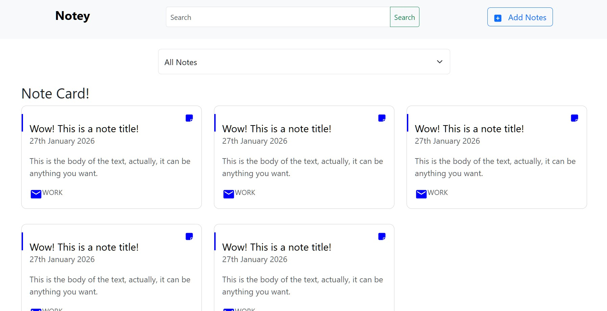

## Block 1: Project set-up
- Followed Django docs: https://docs.djangoproject.com/en/2.2/howto/windows/
- Installed virtual environment tools:
  - `pip install virtualenvwrapper-win`
  - `mkvirtualenv myproject`
- Installed Django inside the virtualenv:
  - `pip install django`
- Created Django project:
  - `django-admin startproject notebook`
- Created app (must differ from project name):
  - `python manage.py startapp notesapp`
- Opened VS Code in project folder with `code .`
- Verified server works:
  - `python manage.py runserver 8004`

## Block 2: App Registration & Models
- Added `notesapp` to `INSTALLED_APPS` in `settings.py`
- Created initial `Note` model in `models.py` with fields (`title`, `body`, `slug`, `category`, `created`, `updated`)
- Created  `save` function to create a unique slug for urls on the first save in `models.py`.
- <ins>ISSUE</ins>: I had not realised I'd forgotten relevant imports (`slugify, get_random_string` from `django.utils`) in `models.py` until later running code. 
- Ran the initial migrations 
  -> This sets-up Django's default database, while running these commands again commits any changes in `models.py` to keep things in sync
  - `python manage.py makemigrations`
  - `python manage.py migrate`
- Created admin superuser for testing 
  - `python manage.py createsuperuser`
  - details -> user: user, password: password
- Ran server, and logged into admin to check it works:
  - `python manage.py runserver`
  - at http://127.0.0.1:8000/admin/
  - `Notesapp` appeared as a Model, with Notes, Add, Change all present. 
  - Successfully created a test note with all fields. 
  - Successfully updated the test note. 
  - Note kept after re-running server.
  - Successfully deleted the test note and re-ran server to check. 

## Block 3
- Added 3 test notes through admin, one in each category.
- Created `NoteAdmin` class with categories `title`, `category`, `created`, `updated` in `notesapp/admin.py`
- Checked `http://127.0.0.1:8000/notes/` for the existing notes.
- Added `Postman VSCode Extension`.
- Created `note_detail` function in `notesapp/views.py` to handle GET, PUT and DELETE requests regarding note details and error responses. 
- Added to urls.py - path("notes/<slug:slug>/", views.note_detail, name="note_detail"),
- Used Postman Extension to POST a new note.

## Block 4: Starting React Side
- Downloaded and installed Node.js (Windows installer MSI) from https://nodejs.org/en/download
  - Installed in folder: `C:\Users\user\Documents\react_25`
- Attempted to create React app using Vite:
  - `npm create vite@latest react-note-app`
  - Selected options: React framework, JavaScript variant, No to rolldown-vite experimental
  - <ins>ISSUE</ins>: Received error 4084 during setup
    - Troubleshooting steps attempted:
      - Opened PowerShell as admin and ran `set-executionpolicy remotesigned`
      - Uninstalled global create-react-app: `npm uninstall --global create-react-app`
      - Created React app using create-react-app instead: `npx create-react-app react-note-app`
- Opened project in VS Code: `code .`
- Set up development environment:
  - Opened new terminal in VS Code (Command Prompt)
  - Navigated to `react-note-app` directory
  - Started dev server: `npm run dev`
  - Verified server running at localhost (e.g., http://localhost:5174/)

## Block 5: React Side (NavBar)
- Cleaned up default files:
  - Deleted `App.css` file
  - Cleared all contents of `App.jsx`
- Created basic App component:
  - Used VS Code snippet `rafce` (React Arrow Function Component Export) in `App.jsx`
  - Added test "Hello World" display to verify setup
- Set up project structure:
  - Created `components` folder under `src` directory
  - Created `NavBar.jsx` file in components folder
  - Used `rafce` snippet to generate component template in `NavBar.jsx`
- Added styling:
  - Updated `index.css` with custom styles (Ubuntu font, card styles, etc.)
  - Added styling to `NavBar.jsx` component
- Installed dependencies:
  - Installed react-icons: `npm install react-icons`
  - Added `FaSquarePlus` icon import from `react-icons/fa6` in `NavBar.jsx`
  - Installed react-router-dom: `npm install react-router-dom`
  - Added `Link` and routing hooks (`useNavigate`, `useLocation`) imports from `react-router-dom` in `NavBar.jsx`
- Created `NavBar` component with navigation structure:
  - Added "Notey" brand/logo link
  - Added search bar with input and search button
  - Added "Add Notes" button with `FaSquarePlus` icon
  - Included navigation routing functionality
- Updated `App.jsx` to render `NavBar` component

## Block 6: React Side (Filter)
- To set up the development environment again. 
  - navigate to react-note-app in terminal and run `npm run dev`
  - check http://localhost:5174/
  - <ins>ISSUE</ins>: Blank page
  - <ins>SOLVED</ins>: Press F12, check `Console`, missing import to `NavBar.jsx` in `App.jsx`. 
- Also, actually installing `bootstrap` 
  - Installation in the terminal (`npm install boostrap`)
  - Going to `main.jsx` and adding import `import 'bootstrap/dist/css/bootstrap.css'`
  - YAY THINGS LOOK BETTER
- Introducing the new component `Filter` by creating new file `src/components/Filter.jsx`
    - `width: "600px"` -  Width of the new filter bar
    - `margin: "20px auto"` - Margins from the top/bottom of the filter bar
    - `style={{ height: "50px" }}` - height of the filter bar
    -  [the `<select> <option>` structure](https://react.dev/reference/react-dom/components/select) for the filtering options `""` (ALL), `WORK`, `PERSONAL`, `IMPORTANT`.
- Updating `App.jsx` with our new component:
  - Putting `<Filter />` alongside (well, under) the existing `<NavBar />` 
  - Adding `import Filter from './components/`

## Block 7: React Side (NoteCard)
- Introducing the new component `NotesCardContainer` by creating new file `src/components/NotesCardContainer.jsx`.
  - Updating `App.jsx` with our new component `<NotesCardContainer />` and the imports `import NotesCardContainer from './components/NotesCardContainer'`
- Introducing the new component `NotesCard` by creating new file `src/components/NotesCard.jsx`
  - Importing icons `MdMarkunread` and `FaNoteSticky` from the [site](https://react-icons.github.io/react-icons/) by adding their linked imports (found in their description).
  - Goal: Get the visuals set up, such that a dummy note can display properly (dummy text for the heading, body text, category).
  - Add `<NoteCard />` multiple times to `NotesCardContainer.jsx` to display multiple of the same dummy note (checked Console/F12 when things didn't display) correctly. 

