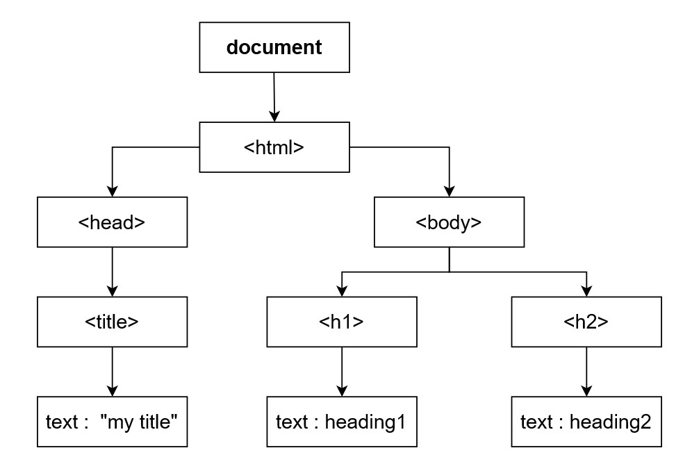

This section serves as a reference point of concepts learned or solidified through this project.

# Table of Contents
1. [Models in Django](#Models)
2. [Migrations in Django](#Migrations)
3. [DOM, Components and Advantages of React](#DOM-&-Components-(React))
4. [JSX in React](#JSX)
5. [Github](Github)

## Models
- SlugField: generates user-friendly part of URL instead of original ID (eg. '1' -> 'contact-us')

## Migrations 
[Reference documentation](https://docs.djangoproject.com/en/5.2/topics/migrations/)
- It's how django propagates changes to models (adding fields/deleting models) in the database. 
- Commands: 
    - `migrate` (applying/unapplying migrations)
    - `makemigrations` (creating new migrations based on changes make to models - similar to commits)
    - `sql migrate` (displays dql statements for a migration)
    - `showmigrations` (lists project's migrations and their status)
- Most capable backend support option: `PostgreSQL`
- Workflow: 
    1. Make changes to your model, then run: `python manage.py makemigrations`. Check if it's what you intended. (You can add a more meaningful name by following format `python manage.py makemigrations --name changed_my_model your_app_label` instead.)
    2. Apply them to your database to make sure they work as expected: `python manage.py migrate`
- [Reversing migrations](https://docs.djangoproject.com/en/5.2/topics/migrations/#reversing-migrations)
    
## DOM & Components (React) <a name="DOM-&-Components-(React)" />
<b>DOM (Document Object Model)</b>: "represents the web page as a tree structure. Any piece of HTML that we write is added as a node, to this tree." -- [Source: FreeCodeCamp](https://www.freecodecamp.org/news/reactjs-basics-dom-components-declarative-views/).
Here is an example of a DOM tree:

<b>Components</b>: Everything in React is a component, they are like functions (eg. improving reusability, abstraction and avoiding redundant code). 
    - They tend to be capitalised to distinguish between html tags and components eg. <Card />
    - The topmost component (as it's a tree) is the <**App />** component (provided by React).

### Advantages of React 
- Code Maintainability, because we can now reuse components and break complex logic into smaller parts.
- Fast and Performant, because only part of the browser DOM is updated instead of the whole thing (as trees are easy to search and compare)
- One way Data Flow, which means that data flow is possible only from the parent component to child components. That is, components are nested, with the top most component being App. This keeps everything modular. 
- Easy to learn and use, development time is less and learning curve is small.

^ [again source: FreeCodeCamp](https://www.freecodecamp.org/news/reactjs-basics-dom-components-declarative-views/).

## JSX
> "JSX is a syntax extension for JavaScript that lets you write HTML-like markup inside a JavaScript file. Although there are other ways to write components, most React developers prefer the conciseness of JSX, and most codebases use it." -- [Source: React Documentation](https://react.dev/learn/writing-markup-with-jsx)
 
 ### The Rules of JSX
 1. Return a single root element 
    - Wrapping up HTML that return multiple elements (let's say for example `<H1></h1>`, `

`, and `</img>`) in a single parent tag such as Fragment tags `<></>` or DIV tags `

`. 
    - Why? "JSX transforms to plain old JavaScript objects. You can’t return two objects from a function without wrapping them into an array." (again, source: react documentation.)
 2. Remember to close your tags.
    - self-closing tags: `` must become ``
    - wrapping tags: `<li>oranges</li>`
 3. camelCase most of the things! 
    - JSX doesn't do well with key words (eg. Class) or dashes. This is another limitation as JavaScript objects.

## Github

Clarifying commands, concepts in github, such as:
- `git add` 
- `git commit -m`
- `git push`
- `git migrate`
- `git pull`
- `git fork`
- How to initialise a repository: 
    - Create an empty repository in Github
    - `git init` in your terminal at the required location
    

